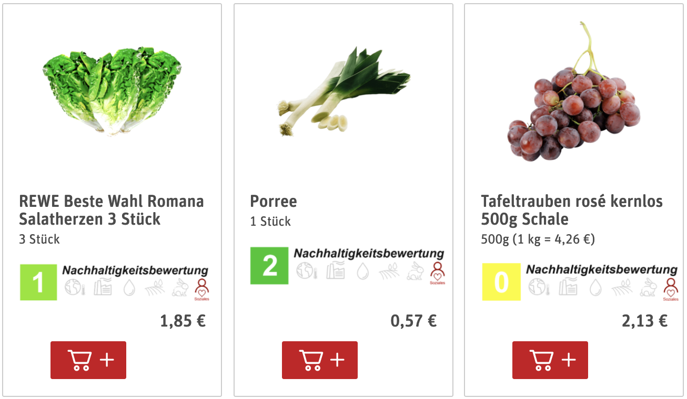

# Installation Guide

</img>

# Introduction

The research project ‘eCommerce Widget for Sustainability’ aims to assess the potential of digital interventions to improve individual food selection in eCommerce environments. In particular, the goal of this research project is to identify the impact of sustainability-oriented (e.g. Beelong) label on consumer behavior. Therefore, we will implement a web-based browser extension that seamlessly integrates into existing online grocery shopping websites to visualize the nutritional and/or environmental impact of a product to the consumer. Further, the application is designed to track how consumers engage with the website (e.g. which products are looked at and which products are actually purchased) post-exposure to sustainability label.

This project is based on product data from the eCommerce website as well as data from a new database, which includes more than 9k products with data on the environmental emissions generated during severa phases of the supply chain of the food products sold in Switzerland. This database enables us to display relevant information, such as a GHG emissions (GWP100), Fine Particulate Matter (PM2.5), Water and Land Use of each product.

We plan to recruit between 100 and 1000 volunteers for the eCommerce shopping study within the university laboratories available at ETH, HSG and FAU. After collecting behavior data from the experiments, we will analyse the user behavior as a response to label exposure using descriptive statistics and machine learning to detect if and how such labels can influence customer decision-making during shopping journeys in eCommerce environments.

This project is a research project of the Auto-ID Labs ETH/HSG (www.autoidlabs.ch). Find out more about the research project here: https://www.autoidlabs.ch/projects/ecommerce-widget-for-nutrition-and-sustainability/ 

# How to Install 

### Download and Unzip
To install the Google Chrome extension, please download the ZIP of the repository.
Unzip the archive locally on your machine.

### Set Your Chrome Browser to Developer Mode
On Google Chrome type : chrome://extensions/. Enable the developer mode (right top of the browser). 
Press the 'Load Unpacked' Button and select the **build** folder inside the ZIP you just downloaded. 
The Extension is now installed on your Chrome Browser.

### Go shopping 
Go to https://produkte.migros.ch/ to test the application and discover better food choices! 

# Frontend Development

### Admin mode
On https://produkte.migros.ch/, click the extension icon to enter the admin mode. You can change your settings there. 

### BUILD
Make sure to have node and npm installed
Download the repo
From the root folder
`npm watch` and `npm build` to run the development mode and build the package

# Backend Development
The backend is running on Google firebase with node.js development.The main function of our backend is to receive and store all user datda during the experiment. Current code can be found at https://github.com/SereneLian/NutriScore-Firebase

### Data Access
To view the backend data, please go to google firebase console and get access to this project. Click the "database" then you can find all required data. We are planning to use google bigquery to implment furthur analysis.

### Data Export
Go to google cloud cell https://console.cloud.google.com/home/dashboard?project=ecommercewidget-265813&cloudshell=true and set the project id gcloud config set project ecommercewidget-265813. Then export the data with following command:` gcloud firestore export gs://firework_to_big_eco_project --collection-ids users,events`

### Data Import 
Go to bigquery and click "creat table". Choose "import from google cloud store" and click our bucket to import data.
