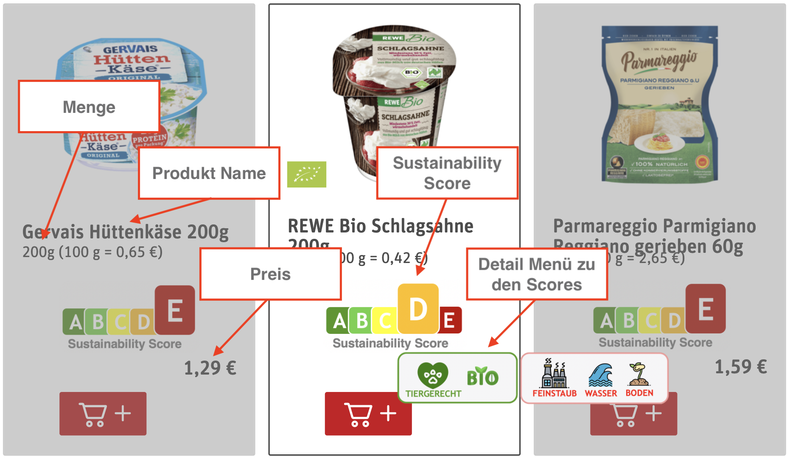
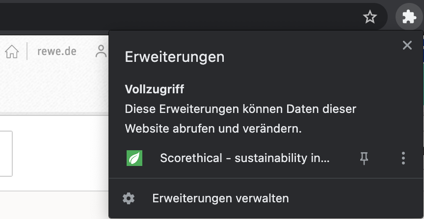

# Installation Guide

</img>

# Introduction

The research project ‘eCommerce Widget for Sustainability’ aims to assess the potential of digital interventions to improve individual food selection in eCommerce environments. In particular, the goal of this research project is to identify the impact of sustainability-oriented labels on consumer behavior. Therefore, we will implement a web-based browser extension that seamlessly integrates into existing online grocery shopping websites to visualize the environmental impact of a product to the consumer. Further, the application is designed to track how consumers engage with the website (e.g. which products are looked at and which products are actually purchased) post-exposure to the sustainability label.

This project is based on product data from the eCommerce website as well as data from a database, which includes more than 6k products with data on the environmental emissions.

This project is a research project of the Auto-ID Labs ETH/HSG (www.autoidlabs.ch). Find out more about the research project here: https://www.autoidlabs.ch/projects/ecommerce-widget-for-nutrition-and-sustainability/ 

# How to Install 

## Quick install
The application is uploaded to the chrome web store: https://chrome.google.com/webstore/detail/scorethical-sustainabilit/mfhkajhofhdlajfepghhhblamgbapdkg
Note that the repository is not linked to the web store and that changes are not automatically reflected.

## Developer install

### Download and Unzip
To install the Google Chrome extension, please download the ZIP of the repository.
Unzip the archive locally on your machine.

### Set Your Chrome Browser to Developer Mode
On Google Chrome type : chrome://extensions/. Enable the developer mode (right top of the browser). 
Press the 'Load Unpacked' Button and select the **build** folder inside the ZIP you just downloaded. 
The Extension is now installed on your Chrome Browser.

## Go shopping 
Go to https://wwww.rewe.de/ and click the extensions icon in the top right of your browser window. </img>

Enjoy testing the application and discover better food choices! 

# Frontend Development

### BUILD
Make sure to have node and npm installed
Download the repo
From the root folder execture the commands `npm run-script watch` and `npm run-script build` to run the development mode and build the package

# Backend Development
The backend is running on Google firebase with node.js development: https://console.firebase.google.com/u/0/  
The functions can be viewed and changed via google cloud platform: https://console.cloud.google.com/getting-started

### Data Export
Download the credetials file from google firebase and then export the data with following command:`firestore-export --accountCredentials path/to/credentials/file --backupFile path/to/empty/text/file --prettyPrint`
